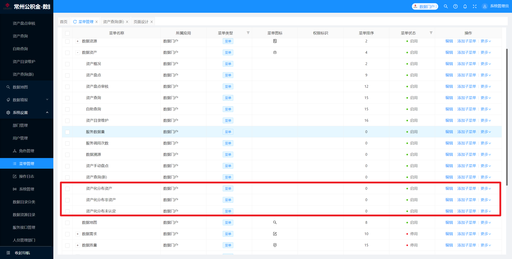

- 昨日问题：
  background-color:: red
	- 列表查询添加添加ywfl;
		- if( $params.keys.length!=0){if($params.data.children){const childrenIds = $params.data.children.map(child => child.id)this.checkedKey = $params.keys.concat(childrenIds).join(',')this.ywID=undefined}else{this.checkedKey = $params.keys[0] //被选中的树节点的codethis.ywID = $params.data.code}}else{this.checkedKey = $params.keys[0] //被选中的树节点的code this.ywID=undefined}this.loadPie() // 加载饼图this.loadList()  // 加载列表数据
	- ~~左侧树点击其他分类图表显示什么；~~
	  background-color:: red
	- 资产化分布图表点击图例弹出新页面，根据是否资产查询。已经新建。
		- ~~[[#red]]==是否显示后面操作按钮、查询、显示列==~~
		- 新建数据列表、数据集，点击图例打开新页面进行查询
	- ~~前端记得构建~~
	- 【文件导入】新用户第一次导入报错。[[$red]]==已经同步到内网==
		- 修改文件： 数据列表_文件数据导入批次列表  sjlb_wjsjdrpclb
- 新功能：
  background-color:: gray
	- 文件导入：判断接入时间，按年按月，只能年导入、月导入
- sjj_zccx_flfb原来的：select a.ywfl as id,count(*) as zcsl,(select name from dc_asset_dir where id = a.ywfl ) as zclx from dc_asset_detail a where a.is_asset = 1 and a.status >= '25' and a.ywfl is not null and a.asset_lx = 1 and nvl(is_deleted,0) =0 group by  a.ywfl
- 今日问题【资产查询】
	- ~~左侧树不和图表联动~~
	- 图表根据业务分类查询列表，[[$blue]]==修改接口，增加业务分类字段查询==
	  background-color:: red
	- ~~资产化分布分成3个表，要有查询字段~~
- 【资产查询】页面
	- 页面-资产查询[[$red]]==zccx== ：
	  collapsed:: true
		- 数据集-数据资产目录_使用者[[$red]]==sjzcml_syz==
		- 数据图表-资产查询_分类分布 [[$red]]==zccx_flfb==：
			- 数据集-数据集_资产查询_分类分布  [[$red]]==sjj_zccx_flfb==
		- 数据图表-资产查询_资产化分布 [[$red]]==zccx_zchfb==：
			- 数据集-数据集_资产查询_资产化分布  [[$red]]==sjj_zccx_zchfb==
		- 数据列表-数据列表_资产查询_列表 [[$red]]==sjlb_zccx_lb== ：
			- 接口-资产查询_报废申请  [[$red]]==zccx_bfsq==
			- 数据集_资产信息 [[$red]]==sjj_zcxx==，
				- 接口-查询资产列表  [[$red]]==cxzclb==
			- 数据集_资产查询_分类获取 [[$red]]==sjj_zccx_ywfl==，
			- 数据集_责任部门 [[$red]]==sjj_zrbm==，
			- 数据表单_资产查询 [[$red]]==sjbd_zccx==：
				- 数据集_资产查询_分类获取 sjj_zccx_ywfl，
				- 数据资产目录_使用者 sjzcml_syz，
				- 数据集_资产明细查询 [[$red]]==sjj_zcmxcx==，
				- 数据模型_资产明细信息表 [[$red]]==sjmx_zcmxxxb==，
				- 中文名：资产明细信息表表   名：DC_ASSET_DETAIL别   名：dcAssetDetail
			- 数据表单_资产查询_报废申请 [[$red]]==sjbd_zccx_bfsq==:
				- 数据集_资产查询_分类获取 sjj_zccx_ywfl，
				- 数据资产目录_使用者 sjzcml_syz
				- 数据集_资产明细查询 sjj_zcmxcx
		- 数据列表-数据列表_资产查询_我的收藏  [[$red]]==sjlb_zccx_wdsc== ：
			- 接口-资产查询_取消收藏  [[$red]]==zccx_qxsc==
			- 数据集-资产概况-我的收藏 [[$red]]==sjj-zcgk-wdsc==
				- 接口-查看我的收藏 [[$red]]==ckwdsc==
			- 数据集_资产查询_分类获取 sjj_zccx_ywfl、
			- 数据集_责任部门 sjj_zrbm
			- 数据表单_资产查询 sjbd_zccx：
				- 数据集_资产查询_分类获取 sjj_zccx_ywfl，
				- 数据资产目录_使用者 sjzcml_syz，
				- 数据集_资产明细查询 sjj_zcmxcx，
				- 数据模型_资产明细信息表 sjmx_zcmxxxb，
				- 中文名：资产明细信息表表   名：DC_ASSET_DETAIL别   名：dcAssetDetail
		- 页面_资产化分布  [[$red]]==ym_zchfb==
		- 数据列表-数据列表_资产化分布_非资产 [[$red]]==sjlb_zchfb_fzc==
			- 数据集-数据集_资产查询_资产化分布查询 [[$red]]==sjj_zccx_zchfbcx==,
			- 数据集_资产查询_分类获取 sjj_zccx_ywfl
			- 数据集_责任部门 sjj_zrbm
		- 数据列表-数据列表_资产化分布_未认定 [[$red]]==sjlb_zchfb_wrd==
			- 数据集-数据集_资产查询_资产化分布查询 sjj_zccx_zchfbcx,
			- 数据集_资产查询_分类获取 sjj_zccx_ywfl
			- 数据集_责任部门 sjj_zrbm
		- 数据列表-数据列表_资产化分布_资产  [[$red]]==sjlb_zchfbcxlb==：
			- 数据集-数据集_资产查询_资产化分布查询 sjj_zccx_zchfbcx,
			- 数据集_资产查询_分类获取 sjj_zccx_ywfl
			- 数据集_责任部门 sjj_zrbm
			- 数据集_资产化分布_业务分类  [[$red]]==sjj_zchfb_ywfl==
			- 数据集_资产化分布_数据主题分类  [[$red]]==sjj_zchfb_sjztfl==
- 新增的不知道需不需要手动增加
	- {:height 407, :width 400}