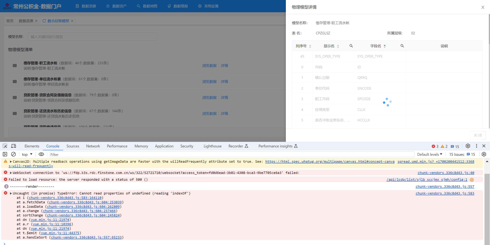

- 今日解决问题：
  background-color:: red
	- DONE 【资产查询】：
	  :LOGBOOK:
	  CLOCK: [2023-11-23 Thu 08:52:04]
	  CLOCK: [2023-11-23 Thu 08:52:55]--[2023-11-23 Thu 16:37:33] =>  07:44:38
	  :END:
		- 1、业务分类图表点击查询，去掉指标。已经同步到内网测试
		  background-color:: yellow
			- 增加一个参数。assetLx = 1
			- 1123资产查询修改文件：
			  background-color:: purple
			  id:: 655edb0a-02a4-409f-9fad-894d2ae520fd
			  :LOGBOOK:
			  CLOCK: [2023-11-24 Fri 08:56:07]
			  :END:
				- 接口 -  查询资产列表 cxzclb
				  background-color:: purple
				- 数据集_资产信息  sjj_zcxx
				  background-color:: purple
				- 数据列表_资产查询_列表  sjlb_zccx_lb
				  background-color:: purple
				- 页面 -资产查询 zccx
				  background-color:: purple
		- 2、点击业务分类时，去掉左侧树条件。已经同步到内网测试
		  background-color:: yellow
			- 1123资产查询左侧树修改文件：
			  background-color:: purple
			  id:: 655eba71-e264-424e-ada0-b84dad2edbc2
			  :LOGBOOK:
			  CLOCK: [2023-11-24 Fri 08:56:23]
			  CLOCK: [2023-11-24 Fri 08:59:23]--[2023-11-25 Sat 15:39:10] =>  30:39:47
			  :END:
				- 页面 -  资产查询 zccx
				  background-color:: purple
		- 3、~~我的收藏页面，点击业务分类也进行查询。是否可以进行查询。不用修改~~
			- ~~修改文件：~~
				- ~~数据列表_资产查询_我的收藏  sjlb_zccx_wdsc~~
		- 4、列表资产编号改为字段zcbh。外网和内网测试环境进行修改。已经改掉
		  background-color:: yellow
			- 修改文件： ((655dfa61-6e82-4694-a4d4-d73699318c12))
			  background-color:: purple
	- DONE 报表0.0.38版本更新
	  :LOGBOOK:
	  CLOCK: [2023-11-23 Thu 13:34:03]--[2023-11-23 Thu 16:27:21] =>  02:53:18
	  :END:
	- 【数据资源】外网已经更新，内网测试已经更新。
		- DONE 查看表-数据集修改，bfd_metadata_table、bfd_metadata_field
		  :LOGBOOK:
		  CLOCK: [2023-11-23 Thu 14:06:47]--[2023-11-24 Fri 14:10:40] =>  24:03:53
		  :END:
			- [[数据集的值]]
			- 缺少：~~rowNum 数据量。不需要显示~~、datasource数据源有了
		- DONE 查看表-详情页面 - 数据集。修改 bfd_metadata_table、bfd_metadata_field
		  :LOGBOOK:
		  CLOCK: [2023-11-23 Thu 14:06:55]--[2023-11-24 Fri 10:23:49] =>  20:16:54
		  :END:
			- 缺少：所属层级、序列号
			- return {template: '
<b>{{record.name}}</b>（数据项：{{record.fieldsCnt}}个,数据量：{{record.rowNum}}条） 说明:{{record.remark}}
'}
		- 1123数据资源 修改文件：
		  background-color:: purple
		  id:: 655f0446-5d26-4c95-9457-4664fac750c0
		  :LOGBOOK:
		  CLOCK: [2023-11-24 Fri 09:00:13]
		  :END:
			- 实体-**中文名**：**元数据表信息****表   名**：BFD_METADATA_TABLE；**中文名**：**元数据字段****表   名**：BFD_METADATA_FIELD
			  background-color:: purple
			- 数据列表 - 数据列表_数仓层级模型  sjlb_sccjmx
			  background-color:: purple
			- 数据集 -  数据集_数仓层级模型_列表  sjj_sccjmx_lb
			  background-color:: purple
			- 原来的数据集： 数据集_数仓层级数据模型  sjj_sccjsjmx
			- 数据表单 -  数据表单_数仓层级模型_详情  sjbd_sccjmx_xq
			  background-color:: purple
			- 数据模型 -  数据模型_元数据表信息  sjmx_ysjbxx
			  background-color:: purple
			- 原来的表单：数据表单_数据模型详情  sjbd_sjmxxq
			- 数据列表 -  数据列表_数据资源接入  sjlb_sjzyjr  查看表参数修改，原参数dsName
			  background-color:: purple
			- 数据集 - 数据集_数仓层级模型_所属层级  sjj_sccjmx_sscj ；详情中显示所属层级中文
			  background-color:: purple
			-
			- 数据资源列表修改
				- 修改文件：| 数据列表_数据资源接入 | sjlb_sjzyjr |；
					- 数据集_数据资源_列表 | sjj_sjzy_lb |
					  background-color:: purple
- 11.20-11.26本周解决问题：
  background-color:: green
  id:: 655ea2d2-ee5e-4d84-9d2b-20e91c8b8ed2
	- 【首页】。已经同步到内网正式测试。
		- DONE 统计一下改为低码配置的修改文件
			- 正式环境数据集：
				- 对内数据服务：sjj_fwtycs。sjj_fwtycs；对外数据服务：sjj_fwsjl。sjj_fwsjl_top10；专题库：sjj_sy_zhuantk。sjj_sy_zhuantk ；主题库：sjj_sy_ztk；数据资产：sjj_sy_sjzc。sjj_sy_sjzc；内部数据：sjj-sy-nbsj。sjj-sy-nbsj；外部数据：sjj-sy-wbsj。sjj-sy-wbsj
			- 修改文件：文件夹1125首页低码文件
			  background-color:: purple
		- DONE 外部接入数据：分页显示需要改变嘛
		- DONE 对内服务没有数据。从内网正式拿数据。表结构不一样。重新建表导数据
		- DONE 内部数据、主题库、应用场景、对内服务的帮助链接不对
		- DONE 按照内网正式环境修改首页
		-
	- 【文件导入】
		- DONE 问题：文件的更新频率只有按月、按年、按季嘛？
		- 修改文件： ((655d57c8-afb4-43b6-a86e-66258e25b3c4))
	- 【资产盘点】-手动盘点页面改为低码平台
		- DONE 问题：缺少前面的0/0。资产项/总项数。要用自定义组件实现，已经实现
		- 修改文件： ((655db570-1840-487a-bf6b-911ef9dde945))
		- DONE  问题
			- 1、整个页面滚动，左侧不滚动
			  2、树控件的搜索，怎么搜索，或者自己定义一个
	- 【页面设计】
		- DONE 列表-点击排序报错，搜索也是一样的错误
			- 表格查询需要接口，没有接口没办法查询，要么详情页面不要有搜索排序等操作，要么去页面设计自己写一个
			- 
	- 【数据资源】正式环境没有导入
		- DONE 导入到内网测试。已经导入