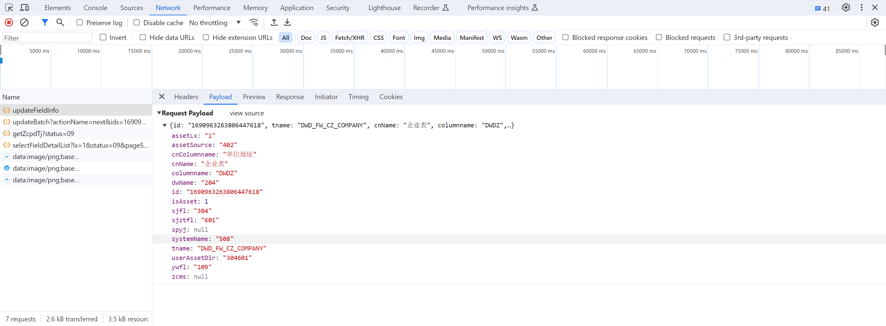
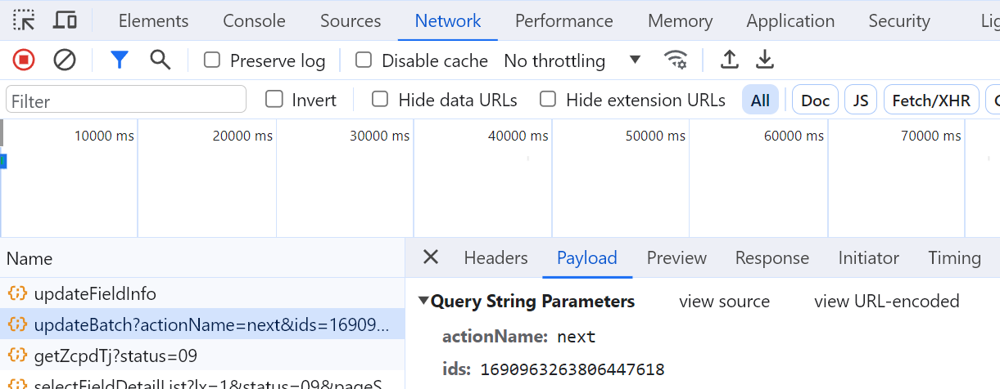

- 【资产盘点】页面改为低码配置页面
	- /api/assets/check/getZcpdTj?status=09，获取左上角数量
	- /api/lcdp/dataset/sjj_zrbm/data，获取部门
	- /api/assets/check/selectFieldDetailList?lx=1&status=09&pageSize=20&pageNo=1，获取资产项列表
	- /api/assets/check/selectFieldDetailList?lx=2&status=09&pageSize=20&pageNo=1，获取指标资产
	-
	- 问题：资产项页面完成
		-
	- 保存接口入参
		- {:height 273, :width 718}
	- 送审接口入参
		- 
		-
- DONE 【文件导入】
  id:: 6563ed55-18f0-4e62-b15b-c11f731ee275
	- DONE 问题：文件的更新频率只有按月、按年、按季嘛？
	- DONE 点击新建时，把列表参数传过去，通过列表查询选择的是否已经存在创建了
- 【资产概况】
	- DONE 数据资源的数据集根据内网正式环境修改。[[$red]]==内网测试没有数据==
		- 数据集_资产概况_信息系统 sjj_zcgk_xxxt
-
-