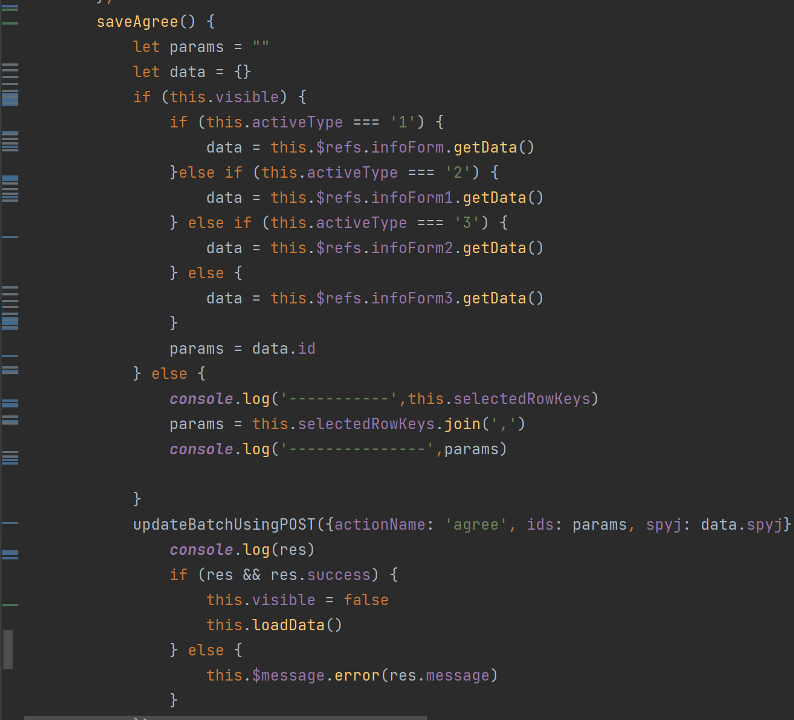
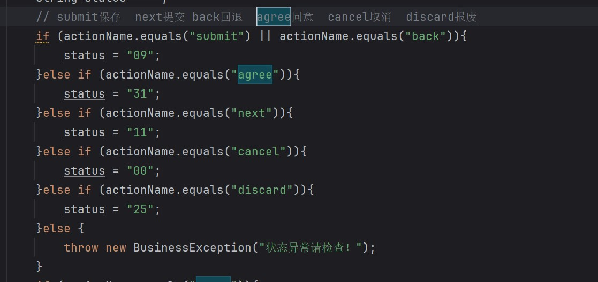
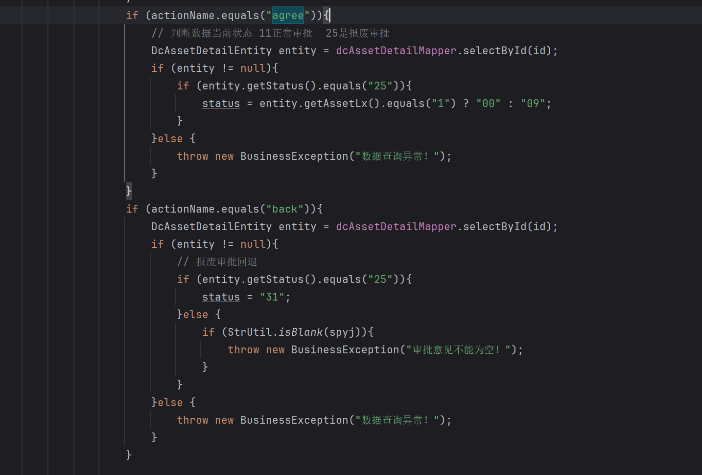

- ((6563ed55-18f0-4e62-b15b-c11f731ee275))
- 【资产盘点】
	- 资产项页面+手动盘点页面完成
	- 修改文件：
		- 页面 - | 页面_资产盘点 | ym_zcpd |
		- 接口 - | 资产盘点_标签左上角数量查询 | zcpd_bqzsjslcx |
		- 数据列表  - | 数据列表_资产盘点_资产项列表 | sjlb_zcpd_zcxlb |
		- 数据列表 - | 数据列表_资产盘点_指标资产列表 | sjlb_zcpd_zbzclb |
		- 数据集 - | 数据集_资产盘点_列表查询 | sjj_zcpd_lbcx |
		- 系统字典 - | 资产审批状态 | ASSET_STATUS |
		- 接口 - | 资产盘点_送审取消资产 | zcpd_qxzc |
		- 数据表单 - | 数据表单_资产盘点_资产项编辑 | sjbd_zcpd_zcxbj |
		- 页面 - | 页面_资产盘点_手动盘点列表 | ym_zcpd_sdpdlb |
		- 数据列表 - | 数据列表_手动盘点_右侧列表 | sjlb_sdpd_yclb |
		- 接口 - | 资产盘点_手动盘点列表查询 | zcpd_sdpdlbcx |
		- 数据集 - | 数据集_手动盘点_查询右侧列表 | sjj_sdpd_cxyclb |
		- 数据表单 - | 数据表单_手动盘点_设为资产 | sjbd_sdpd_swzc |
		- 数据集 - | 数据集_资产盘点_数据资源目录查询 | sjj_zcpd_sjzymlcx |
		- 数据集 - | 数据集_资产盘点_资源目录使用者 | sjj_zcpd_zymlsyz |
		- 数据模型 - | 数据模型_资产明细信息表 | sjmx_zcmxxxb |
		- 接口 - | 资产盘点_手动盘点列表查询 | zcpd_sdpdlbcx |
		- 接口 - | 资产盘点_手动盘点_右侧列表查询 | zcpd_sdpd_yclbcx |
		- 接口 - | 资产盘点_列表查询 | zcpd_lbcx |
		- 接口 - | 资产盘点_自动盘点 | zcpd_zdpd |
- {:height 228, :width 228}
- {:height 222, :width 447}
- {:height 323, :width 457}
- 【首页】修改：对内数据服务：sjj_fwtycs；对外数据服务：sjj_fwsjl
-
-