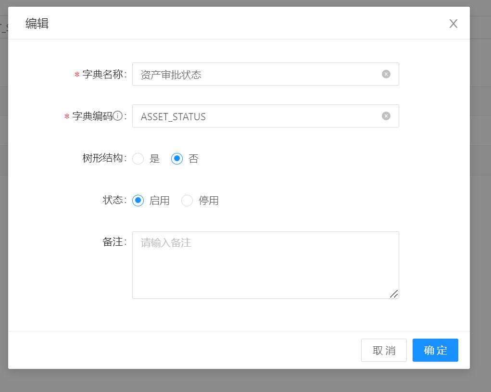
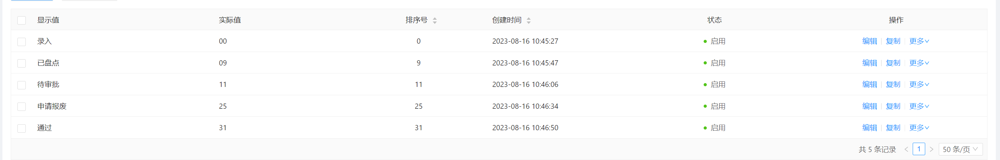

- 修改文件
	- 页面设计：
		- 页面设计 - | 页面_资产盘点 | ym_zcpd |
		- 页面设计 - | 页面_资产盘点审核 | ym_zcpdsh |
		- 页面设计 - | 页面_资产盘点_手动盘点列表 | ym_zcpd_sdpdlb |
	- 数据集：
		- 数据集 - | 数据集_资产盘点_列表查询 | sjj_zcpd_lbcx |
		- 数据集 -| 数据集_责任部门 | sjj_zrbm |
		- 数据集 - | 数据集_资产盘点_数据资源目录查询 | sjj_zcpd_sjzymlcx |
		- 数据集 - | 数据集_资产盘点_资源目录使用者 | sjj_zcpd_zymlsyz |
		- 数据集 - | 数据集_手动盘点_查询右侧列表 | sjj_sdpd_cxyclb |
	- 数据接口：
		- 数据接口 - | 资产盘点_自动盘点 | zcpd_zdpd |
		- 数据接口 - | 资产盘点_送审取消资产 | zcpd_qxzc |
		- 数据接口 - | 资产盘点_列表查询 | zcpd_lbcx |
		- 数据接口 - | 资产盘点_送审取消资产 | zcpd_qxzc |
		- 数据接口 - | 资产盘点_标签左上角数量查询 | zcpd_bqzsjslcx |
		- 数据接口 - | 资产盘点_自动盘点 | zcpd_zdpd |
		- 数据接口 - | 资产盘点_手动盘点列表查询 | zcpd_sdpdlbcx |
		- 数据接口 - | 资产盘点_手动盘点_右侧列表查询 | zcpd_sdpd_yclbcx |
	- 数据列表：
		- 数据列表 - | 数据列表_资产盘点_资产项列表 | sjlb_zcpd_zcxlb |
		- 数据列表 - | 数据列表_资产盘点_指标资产列表 | sjlb_zcpd_zbzclb |
		- 数据列表 - | 数据列表_资产盘点_标签资产 | sjlb_zcpd_bqzc |
		- 数据列表 - | 数据列表_资产盘点_资产项列表 | sjlb_zcpd_zcxlb |
		- 数据列表 - | 数据列表_资产盘点_指标资产列表 | sjlb_zcpd_zbzclb |
		- 数据列表 - | 数据列表_资产盘点_标签资产 | sjlb_zcpd_bqzc |
		- 数据列表 - | 数据列表_手动盘点_右侧列表 | sjlb_sdpd_yclb |
	- 数据表单：
		- 数据表单 - | 数据表单_资产盘点_资产项编辑 | sjbd_zcpd_zcxbj |
		- 数据表单 - | 数据表单_资产项_审核 | sjbd_zcpdsh_sh |
		- 数据表单 - | 数据表单_资产项_报废 | sjbd_zcx_bf |
		- 数据表单 - | 数据表单_资产盘点_指标资产编辑 | sjbd_zcpd_zbzcbj |
		- 数据表单 - | 数据表单_指标资产_审核 | sjbd_zbzc_sh |
		- 数据表单 -  | 数据表单_指标资产_报废 | sjbd_zbzc_bf |
		- 数据表单 - | 数据表单_资产盘点_标签资产编辑 | sjbd_zcpd_bqzcbj |
		- 数据表单 - | 数据表单_标签资产_审核 | sjbd_bqzc_sh |
		- 数据表单 - | 数据表单_标签资产_报废 | sjbd_bqzc_bf |
	- 数据字典：
		- 系统字典 - | 资产审批状态 | ASSET_STATUS |
	- 
	- 
	-
- 【资产盘点】
	- 修改文件：
		- 页面设计 - | 页面_资产盘点 | ym_zcpd |
		- 数据接口 - | 资产盘点_自动盘点 | zcpd_zdpd |
		- 数据接口 - | 资产盘点_送审取消资产 | zcpd_qxzc |
		- 数据列表 - | 数据列表_资产盘点_资产项列表 | sjlb_zcpd_zcxlb |
		- 数据列表 - | 数据列表_资产盘点_指标资产列表 | sjlb_zcpd_zbzclb |
		- 数据列表 - | 数据列表_资产盘点_标签资产 | sjlb_zcpd_bqzc |
		- 数据集 - | 数据集_资产盘点_列表查询 | sjj_zcpd_lbcx |
		- 系统字典 - | 资产审批状态 | ASSET_STATUS |
		- 数据表单 - | 数据表单_资产盘点_资产项编辑 | sjbd_zcpd_zcxbj |
		- 数据模型 - | 数据模型_资产明细信息表 | sjmx_zcmxxxb |
		- 数据表单 - | 数据表单_资产项_审核 | sjbd_zcpdsh_sh |
		- 数据表单 - | 数据表单_资产项_报废 | sjbd_zcx_bf |
		- 数据表单 - | 数据表单_资产盘点_指标资产编辑 | sjbd_zcpd_zbzcbj |
		- 数据集 -| 数据集_责任部门 | sjj_zrbm |
		- 数据表单 - | 数据表单_指标资产_审核 | sjbd_zbzc_sh |
		- 数据表单 -  | 数据表单_指标资产_报废 | sjbd_zbzc_bf |
		- 数据表单 - | 数据表单_资产盘点_标签资产编辑 | sjbd_zcpd_bqzcbj |
		- 数据表单 - | 数据表单_标签资产_审核 | sjbd_bqzc_sh |
		- 数据表单 - | 数据表单_标签资产_报废 | sjbd_bqzc_bf |
		- 数据接口 - | 资产盘点_列表查询 | zcpd_lbcx |
		- 数据集 - | 数据集_资产盘点_数据资源目录查询 | sjj_zcpd_sjzymlcx |
		- 数据集 - | 数据集_资产盘点_资源目录使用者 | sjj_zcpd_zymlsyz |
- 【资产盘点审核】
	- 修改文件：
		- 页面设计 - | 页面_资产盘点审核 | ym_zcpdsh |
			- 数据接口 - | 资产盘点_送审取消资产 | zcpd_qxzc |
			- 数据列表 - | 数据列表_资产盘点_资产项列表 | sjlb_zcpd_zcxlb |
			- 数据列表 - | 数据列表_资产盘点_指标资产列表 | sjlb_zcpd_zbzclb |
			- 数据列表 - | 数据列表_资产盘点_标签资产 | sjlb_zcpd_bqzc |
			- 数据接口 - | 资产盘点_标签左上角数量查询 | zcpd_bqzsjslcx |
			- 数据接口 - | 资产盘点_自动盘点 | zcpd_zdpd |
			-
-
- 【资产手动盘点】
	- 修改文件：
		- 页面设计 - | 页面_资产盘点_手动盘点列表 | ym_zcpd_sdpdlb |
		- 数据列表 - | 数据列表_手动盘点_右侧列表 | sjlb_sdpd_yclb |
		- 数据接口 - | 资产盘点_手动盘点列表查询 | zcpd_sdpdlbcx |
		- 数据集 - | 数据集_手动盘点_查询右侧列表 | sjj_sdpd_cxyclb |
		- 数据表单 - | 数据表单_手动盘点_设为资产 | sjbd_sdpd_swzc |
		- 数据接口 - | 资产盘点_手动盘点_右侧列表查询 | zcpd_sdpd_yclbcx |
		-
-
- 【文件导入】
	- DONE 季度区分问题
-
- // 获取当前季度：
  var currMonth= new Date().getMonth()+1;
  var currQuarter = Math.floor( (currMonth%3 == 0 ? (currMonth/3):(currMonth/3 + 1) ) );
-
- 2115。4709。2594
- DONE 1
-