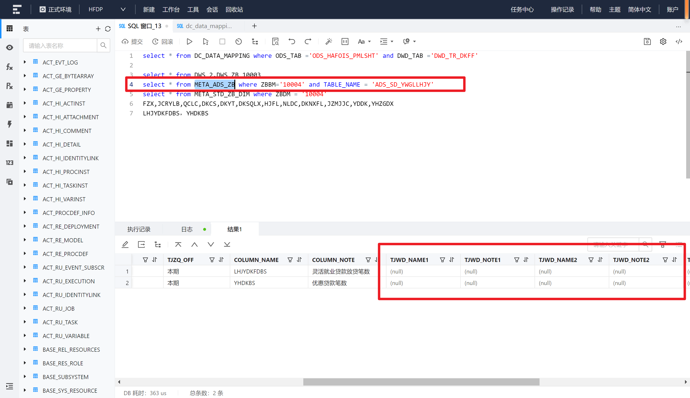
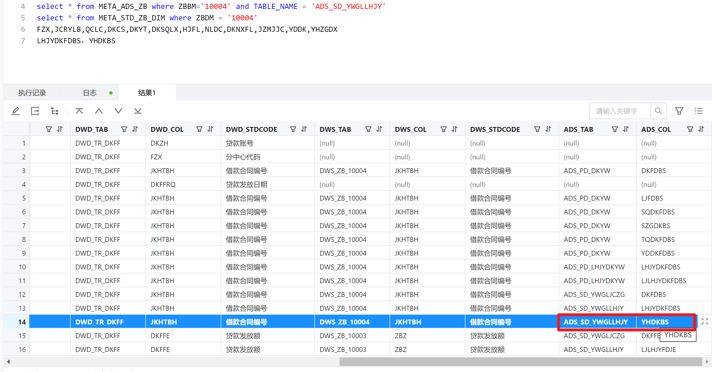

- TODO ADS的表不用区分？只要在这个指标下，都增加
- 【文件导入】
  id:: 6571174b-16cd-4176-8a9d-edcee2256844
	- TODO 视图
- 【溯源增加维度】
	- SQL语句： [[dc_data_mapping中维度数据sql]]
- 【溯源增加数据】
	- SQL语句： [[dc_data_mapping中数据sql]]
- -- 根据指标代码查询META_STD_ZB_DIM这个表中的维度，把这个维度字段作为DWS_TAB为当前指标代码表的DWS_COL字段
  -- 在META_ADS_ZB中没有维度也要加进去嘛，加在哪个字段后面呢
- 
- 在ADS_ZB里面查询字段后面没有维度，也要把维度加进去嘛
- 
- 假如这个字段有个分中心的维度，就新增加一条数据，把DWS_COL改为FZX，DWS_STDCODE改为分中心，其他所有都和这条数据一样？
-