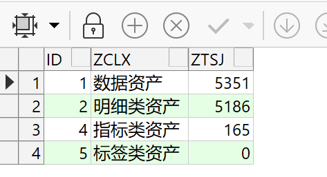
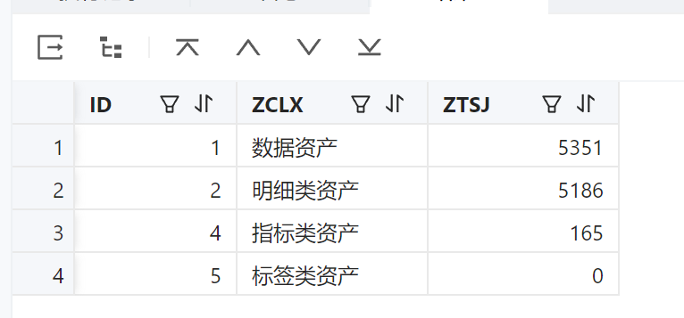
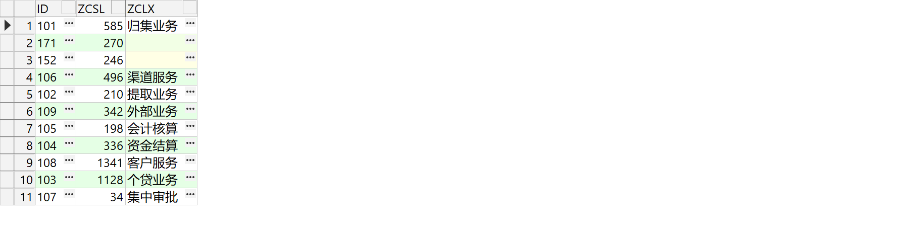
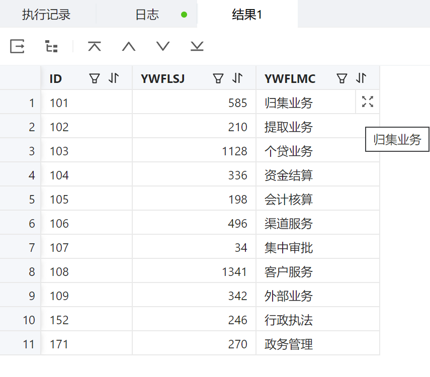
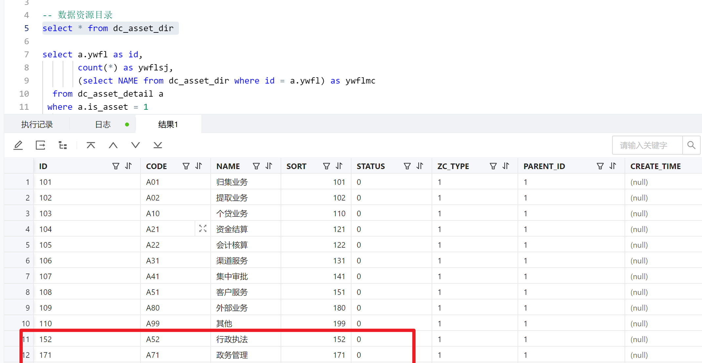

#### 1、内网正式环境添加报表数据集
	- 完成情况：10.31：添加完成，165张表
	- 备注：
	- 修改文件：
- #### 2、文件导入同步到内网测试环境
	- 完成情况：
	         10.31:权限标识重复后端没有更新道内网测试环境；sjj_sjcxzymc数据集查询语句有点问题
	          11.1：内网文件导入已经完成
		- 备注：
			- sjj_sjcxzymc原来的查询：SELECT a.id as userid, b.dept_id, c.id,c.data_name,c.LIST_ORDER,c.query_report,c.imp_report,'' as pidFROM fu_sys_user a JOIN  FU_MGT_USER_DEPT b ON a.id = b.user_id JOIN DC_SJJR_LIST c ON b.dept_id = c.zrbm WHERE a.id = ${userid}。
			  新的查询语句：
			  SELECT  c.id, c.data_name, c.LIST_ORDER, c.query_report, c.imp_report, '' as pid
			  FROM DC_SJJR_LIST c
			  WHERE c.zrbm IN (SELECT a.orgid FROM fu_sys_user a where a.id='3421') OR
			        c.zrbm IN (SELECT b.dept_id FROM FU_MGT_USER_DEPT b where b.user_id='3421')
			  原来的sjj_wjsjdrpcb：select a.*, b.imp_table, b.imp_report, b.query_report from DC_IMPORT_DATA_BATCH a, DC_SJJR_LIST b where a.resource_id = b.id order by a.create_time
			  原来的sjj_wjfsjrdsjzyqd：select id,DATA_NAME,LIST_ORDER,'' as pid,imp_report, query_report from dc_sjjr_list where JRFS = '2' order by list_order
			  新的sjj_wjfsjrdsjzyqd：SELECT a.id,a.DATA_NAME,a.LIST_ORDER,'' as pid, a.query_report, a.imp_report, a.zrbm FROM dc_sjjr_list a INNER JOIN fu_sys_user b ON a.zrbm = b.orgid WHERE b.id =  ${userid} and a.JRFS = '2' order by a.LIST_ORDER
	- 修改文件：
		- 数据集_数据查询资源名称 sjj_sjcxzymc ，已导入到内网测试
		  数据集_文件方式接入的数据资源清单 sjj_wjfsjrdsjzyqd，已导入到内网测试
- #### 3、数据集对比
	- ---sjj_zcgk_zctj   5351
	- 查询结果：
	  
	- 内网查询结果：
	- {:height 365, :width 471}
	- ---sjj_zcgk_ywfl  ：5351
	  查询结果：
	- 
	- 内网查询结果：
		- {:height 259, :width 253}
	- 差这两个数据：dc_asset_dir数据资源目录表
		- {:height 360, :width 453}
- ---sjj_zcgk_ywfl   5351
	- 查询结果：
- #### 4、dc_asset_detail、dc_asset_dir两个表正式环境数据同步到公司
	- 完成情况：
		- 11.3：dc_asset_dir已同步。dc_asset_detail数据没有同步，数据太多怎么同步捏。
			- 【资产概况】头部数据对应不上。应该是未同步数据导致
			- 【资产查询】资产化分布数据对应不上，数据集sjj_zccx_zchfb。同上
	- 修改文件：sjj_zccx_flfb
		- sjj_zccx_flfb修改：
			- 修改前：select a.ywfl as id,count(*) as zcsl,(select name from dc_asset_dir where id = a.ywfl) as zclx from dc_asset_detail a where a.is_asset = 1 and a.status >= '25' and a.ywfl is not null group by a.ywfl
			- 修改后：select a.ywfl as id, count(*) as zcsl, (select name from dc_asset_dir where id = a.ywfl) as zclx from dc_asset_detail a where a.is_asset = 1 and a.status >= '25' and a.ywfl is not null and a.asset_lx = 1  and nvl(is_deleted,0) =0 group by  a.ywfl
- #### 5、【资产查询】两个图表：点击其中某个块下面数据进行查询，右侧图表可以新跳出一个页面
	- 完成情况：11.3：sjj_zcxx数据集调用的接口加一个查询选项
	- 页面设计：资产查询 zccx：console.log('参数',$params.eventData.id)this.getComponent('list1').query({aa: 1})
	- 接口：查询资产列表 cxzclb
	-
- 页面一致性：
	- 外网：
	- 
	- 
	- 
	- 内网正式环境：
		- 
		- 
		- 
		-