- **通过****npm info fusion-report-ui**** 获取最新版本, 并通过浏览器下载, 解压压缩包内****fusion-report-ui.css****及****fusion-report-ui.umd.min.js****, 放至项目public目录**
- 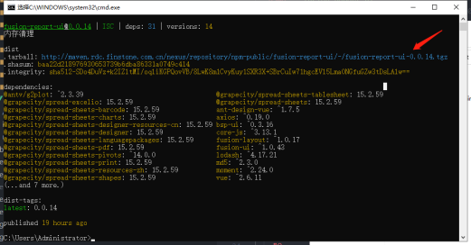{:height 102, :width 304}
- 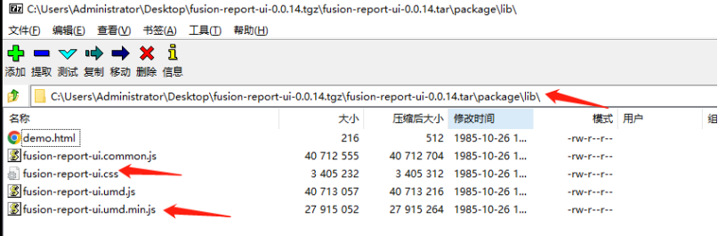{:height 69, :width 315}
- 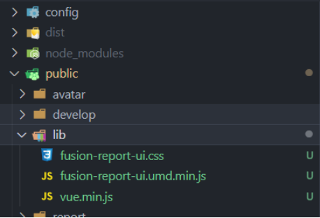{:height 120, :width 165}
- 富深学院学习平台账号和密码已开通，大家课登录平台进行学习
	- 平台网址：http://edu.finstone.com.cn:13001/index
	- 账号：OA预留手机号15714183102
	- 密码：831660
- OA:1044 密码：831660
- 邮箱：zhanghana@finstone.com.cn密码：QWEasd@123
  background-color:: purple
	- 原密码：bt*7A3JS9h
- 上网账号：zhanghan 密码：7890-poi
- 低码平台：http://demo.bsp.k3s.rdc.finstone.com.cn/
	- admin/123456
- 低码开发环境：
	- oracle数据库地址：172.16.1.57 /orapdb
	- 用户密码：hfmis_fdp_n/123
- 数据门户公司访问地址：admin/123456
- 数据门户 内网访问地址 http://2.63.204.197:8080
- 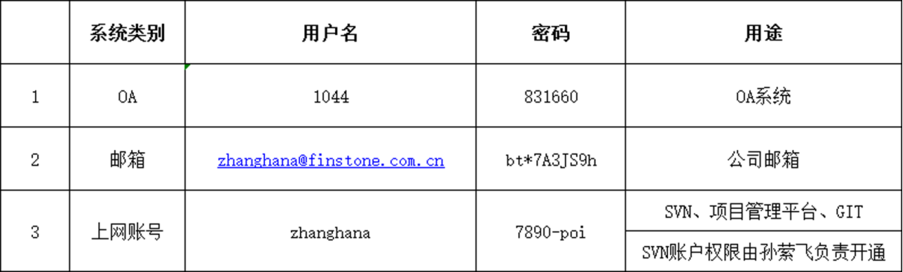
- npm config set registry
- yarn add fusion-ui  bsp-ui
- 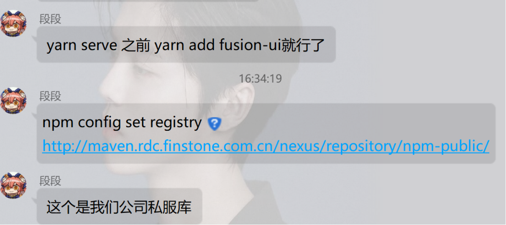{:height 233, :width 448}
- 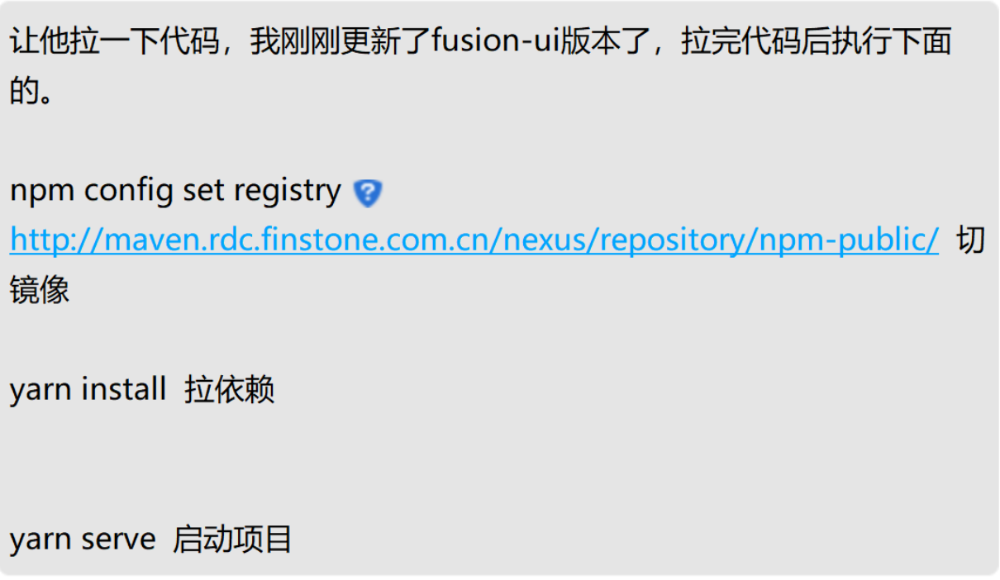{:height 279, :width 453}
- 前端代码构建：
	- http://console.k3s.rdc.finstone.com.cn/
	  wuqi/wuqi@123
	- 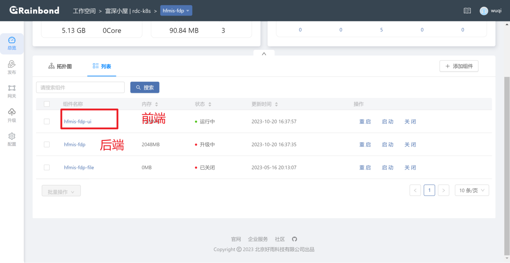{:height 182, :width 416}
	- 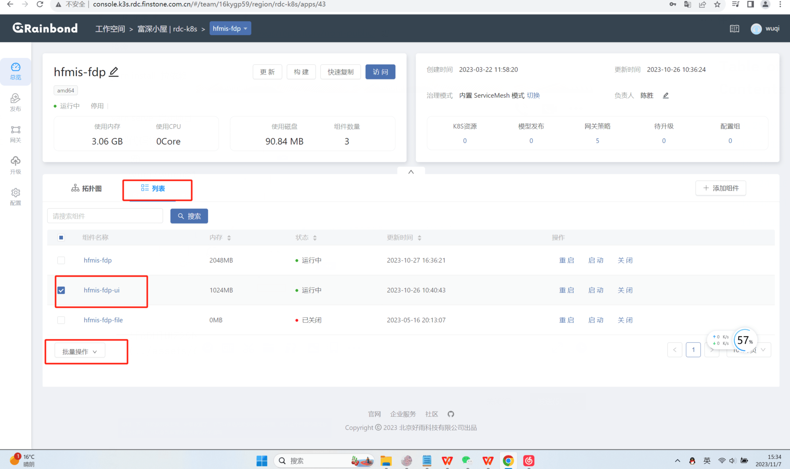{:height 390, :width 427}
	- 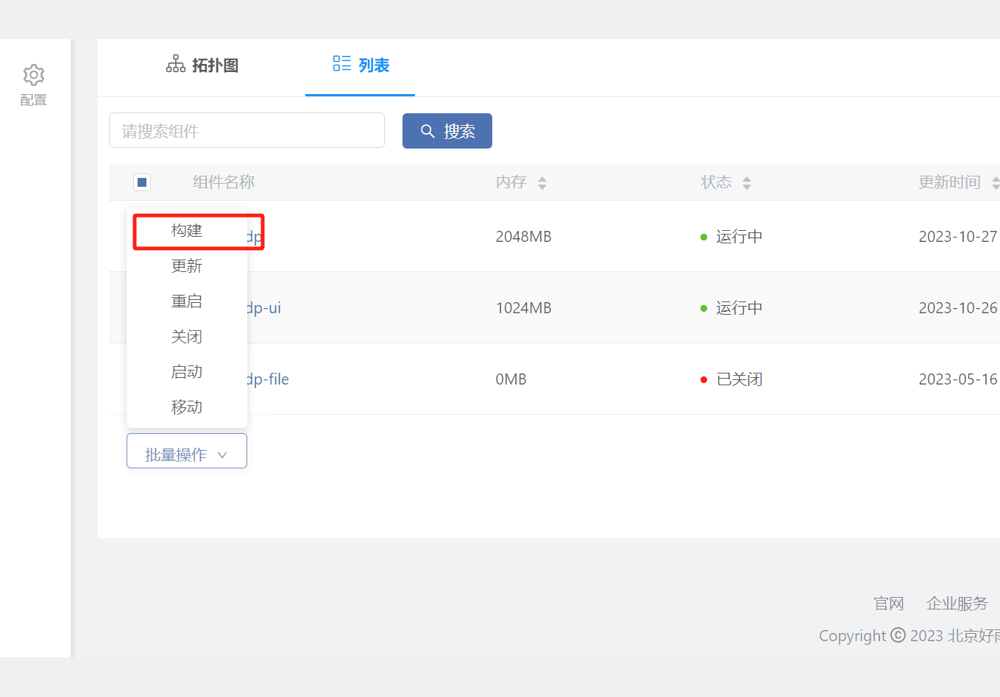{:height 331, :width 331}
- 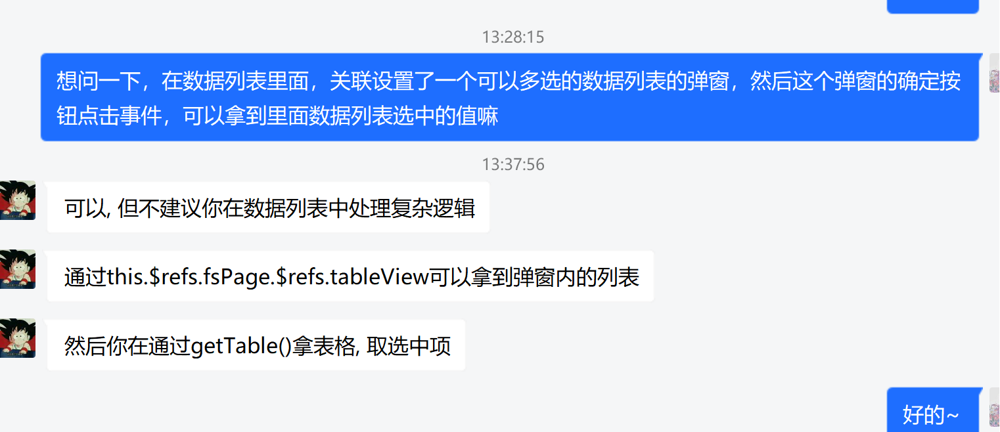{:height 183, :width 363}
- 197:baoll  gjj@2023
- 公司环境 ： baoll  gjj@2023
- 获取自定义组件中的组件数据的值
	- 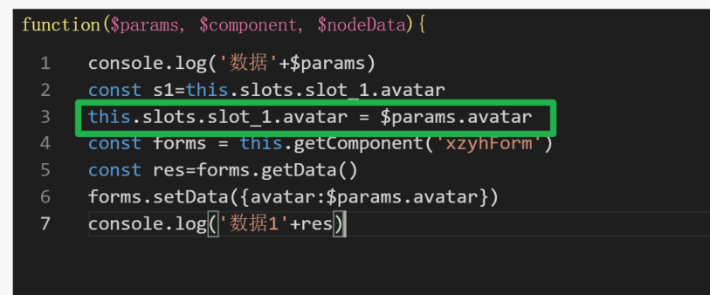{:height 210, :width 342}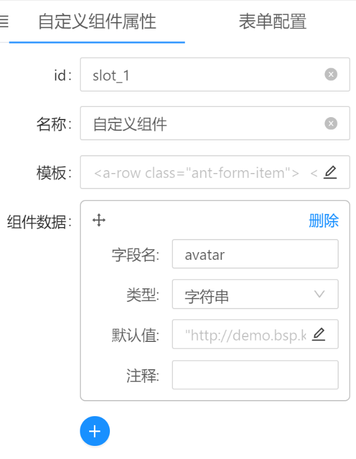{:height 263, :width 213}
- 上周学习了低码平台和报表平台的使用，做了一个列表页和报表，进行了尝试，大部分功能已经掌握，实现列表页面已经没有问题，遇到的问题也问了人得到了解决。之后要提高完成页面的效率，继续对平台进行深入学习。
- 把红圈里的改成dictCode: 'ASSET_STATUS'就和字典关联了。"ASSET_STATUS"表示字典的code
	- 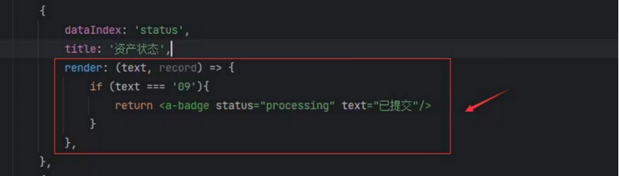{:height 187, :width 598}
	-
- 渲染函数
	- return {template:	'
{{record.username}} {{record.realname}}
'}
	- 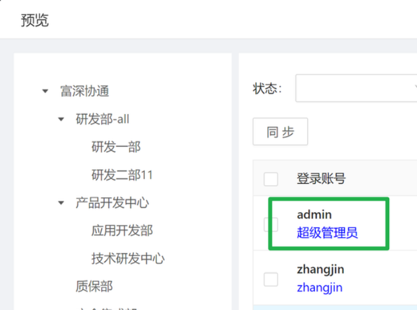{:height 248, :width 380}
- 数组类型显示
	- 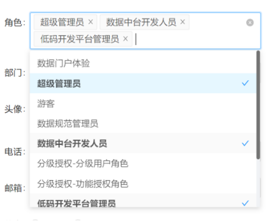
- 低码平台实现弹窗列表：
	- 1、关联设置，关联另一个数据列表
	- 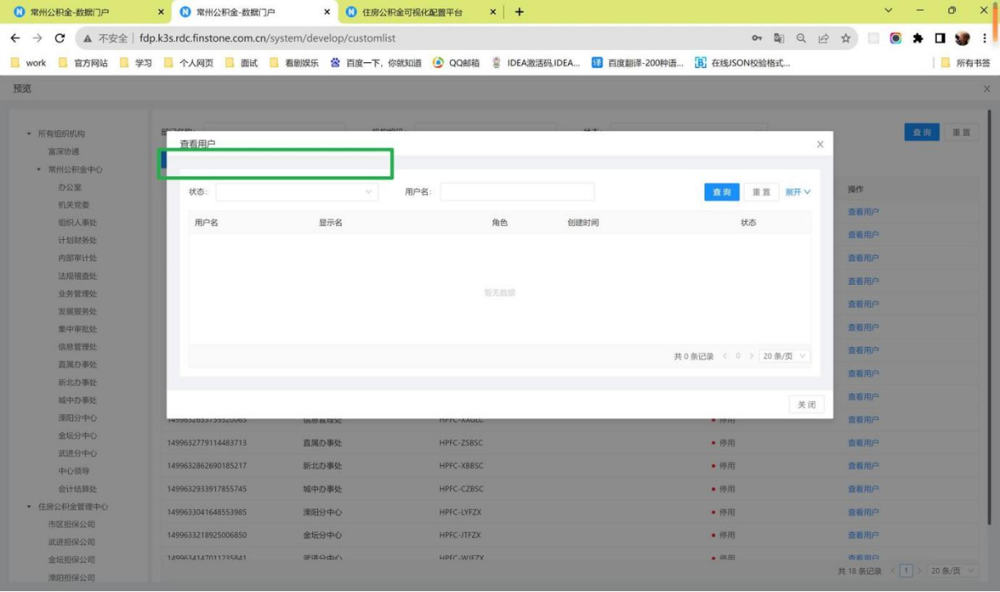{:height 206, :width 423}
	- 2、关联之后多出来一个框，内嵌的表格的布局设置给改了，改成没内边距的
	- 3、最终实现：
	- 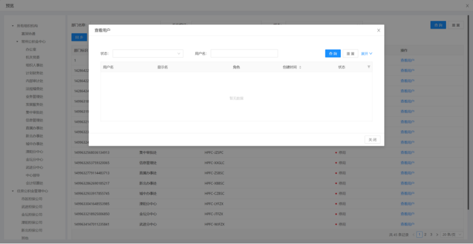{:height 161, :width 418}
- 接口body参数写法：
	- 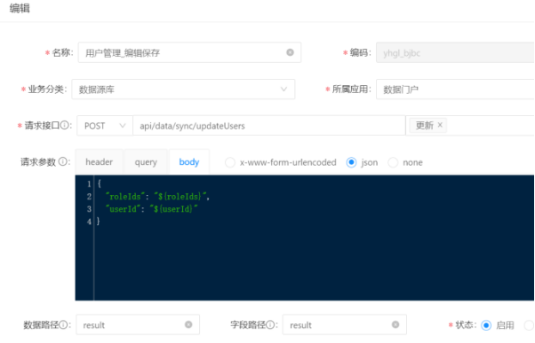{:height 293, :width 413}
- 数据列表左侧树默认选中项：
	- this.getTree().componentData.selectedKeys = ['1'] // 左侧树选中项  
	  const form = this.getForm()
	  form.setData({zcType: 1}) // 查询区表单内容赋值
	  this.query()		// 带参数查询
- 关闭弹窗的方法：this.closeModal()
- 表单取数：getData()，表格在编辑的时候用getData()，查询时用loadData()
- 哈希对比文件方法：CertUtil -hashfile file_name SHA256
	- 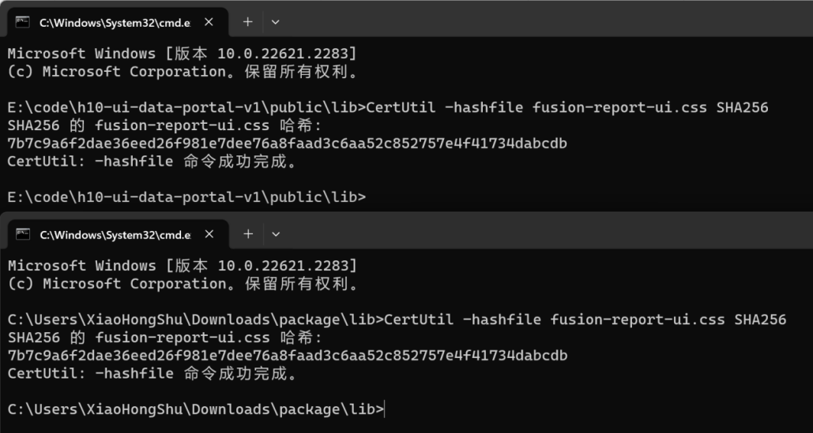
-
- 【锁表查询】
  select sess.sid,
        sess.serial#,
        lo.oracle_username,
        lo.os_user_name,
        ao.object_name,
        lo.locked_mode
   from v$locked_object lo, dba_objects ao, v$session sess
  where ao.object_id = lo.object_id
    and lo.session_id = sess.sid;
- 【解锁】
  alter system kill session '581,63198';--分别为SID和SERIAL# 号
- 内网正式环境：baoll  ubojlCre
- 图表的点击事件, 然后获取我的列表, this.getComponent('xxxxx'), 取数this.query({aa: 1})
- this.getComponent('xxxxx').query({aa: 1})
- HEA{U78(2MFST6P9_1699251875522_0.png)
- # 2023.11.8
	- 数据列表功能按钮获取，修改按钮属性
		- 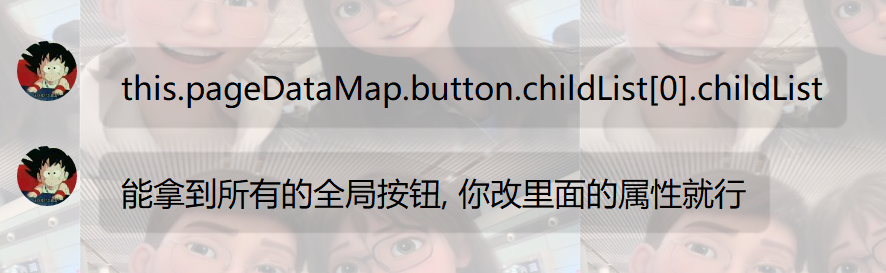{:height 213, :width 706}
		- this.pageDataMap.button.childList[0].childList
	- window.$post调用接口
		- 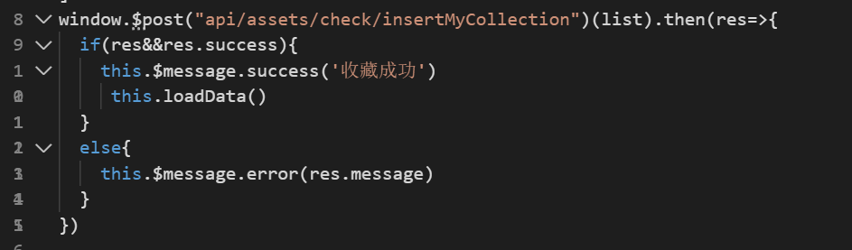
		-
	- 图表：点击图例查询下面列表
		- 图例里可以拿到当前图表的数据的。可以变通一下，根据图表数据和这个文字拿到当前被点击图例对应的数据。
		- $params.chartEvent.view.options.data 图表的所有数据
		- $params,chartEvent.view.filteredData.find(item => item.zclx === "图例的文字")图表过滤之后的数据
		- 配置里加上这个，点击图例就不筛选数据了
			- 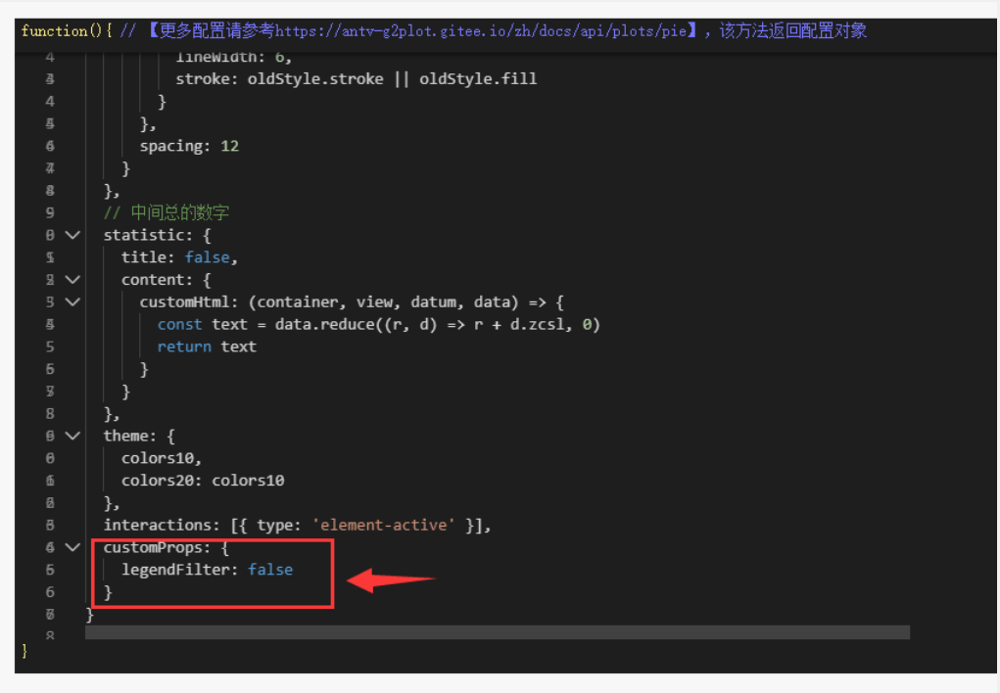{:height 424, :width 414}
		- customProps: {
		      legendFilter: false
		    }
		  customProps表示我们自己定义的属性，不是g2plot本身的属性。  legendFilter: false  表示点击图例
		  不筛选图表数据
- word通配符查找日期格式:'([0-9]{4}-[0-9]{2}-[0-9]{2} [0-9]{2}:[0-9]{2}:[0-9]{2})'
- 替换todate格式插入数据库：TO_DATE('\1','YYYY-MM-DD HH24:MI:SS')
- [{"itemText": "资产", "itemValue": 1},{"itemText": "非资产", "itemValue": -1}]
- WiFi密码：13775633503
- xk  gjj@20230302 内网正式环境
- 获取字典：
	- export const getDictListByCodeApi = (dictCode) => $get(`api/system/dict/${dictCode}/itemlist`)
- 执行脚本：python "C:\Users\XiaoHongShu\Desktop\新建文件夹\ex.py"